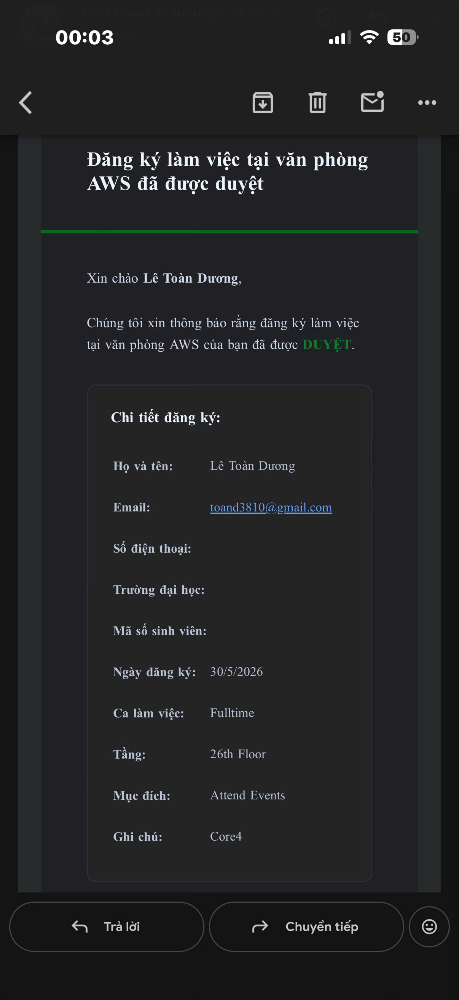

# Báo cáo sự kiện: “Saturday Meetup”

### Mục tiêu tham gia

- Giao lưu tại buổi Saturday Meetup do cộng đồng AWS Study Group tổ chức.
- Tiếp thu các câu chuyện và góc nhìn thực tế từ đội ngũ diễn giả, khách mời.
- Kết nối với các anh chị tiền bối đi trước trong ngành IT và các bạn sinh viên.
- Tích lũy kinh nghiệm thực chiến để áp dụng vào việc học và xây dựng các project phần mềm.

### Nội Dung Nổi Bật

- Kinh nghiệm thực chiến từ cựu thí sinh Hackathon về quy trình lên ý tưởng, phối hợp đồng đội, hoàn thiện sản phẩm thần tốc và các bài học đúc kết sau giải đấu.
- Case study dự án "Đại Việt Tử Vi" dưới góc nhìn kỹ thuật: Từ bài toán khởi tạo sản phẩm, thiết kế kiến trúc hệ thống đến những thách thức thực tế khi đưa ứng dụng lên môi trường production.
- Phiên thảo luận và kết nối mở: Trao đổi trực tiếp với khách mời về tối ưu hóa quy trình phát triển phần mềm, xu hướng Điện toán đám mây (Cloud Computing) và định hướng sự nghiệp tương lai.

### Những Gì Học Được
- Thấu hiểu lộ trình hiện thực hóa một giải pháp công nghệ, từ khâu định hình concept ban đầu cho đến khi phát hành sản phẩm ra thị trường.
- Tiếp thu tư duy xây dựng cấu trúc nền tảng, cách giải quyết các bài toán kỹ thuật phát sinh khi vận hành web app từ góc nhìn của các tiền bối.
- Nhận diện giá trị của các sân chơi tốc độ cao (Hackathon) trong việc tôi luyện phản xạ xử lý rủi ro và bứt phá kỹ năng phối hợp nhóm dưới áp lực thời gian.

### Ứng Dụng Vào Công Việc
- Chuẩn hóa quy trình thiết kế MVP và quản trị tiến độ khi thực hiện các đồ án chuyên ngành lẫn project cá nhân.
- Vận dụng tư duy xây dựng cấu trúc nền tảng và tối ưu hạ tầng từ dự án thực tế vào kiến trúc các web app tiếp theo.
- Chủ động đào sâu chuyên môn về hệ sinh thái AWS và công nghệ Cloud để sẵn sàng thử sức ở các đấu trường công nghệ lớn.
### Trải nghiệm trong event
- Buổi Saturday Meetup đã mang đến cho mình những góc nhìn vô cùng trực quan, giúp khỏa lấp khoảng cách giữa lý thuyết giảng đường và bức tranh công nghệ thực tế nhờ vào câu chuyện từ các khách mời giàu trải nghiệm.
- Nội dung thảo luận về Hackathon đem lại nguồn cảm hứng lớn về tư duy tối ưu hóa sản phẩm tinh gọn, kỹ năng quản trị nhân sự trong team cũng như cách ứng biến linh hoạt trước các sự cố sát giờ G. Trong khi đó, hành trình thực chiến của dự án "Đại Việt Tử Vi" lại giúp mình hình dung rõ nét về các giai đoạn thiết kế, triển khai hạ tầng và duy trì độ ổn định cho một hệ thống web trong môi trường thực tế.
- Không chỉ dừng lại ở khía cạnh chuyên môn, sự kiện thực sự là một cầu nối giá trị giúp mình hòa nhập vào cộng đồng, có cơ hội tham vấn các tiền bối đi trước và tìm thấy những người bạn đồng hành chung chí hướng trong mảng Điện toán đám mây và Kỹ thuật phần mềm.
### Ảnh tham gia sự kiện

